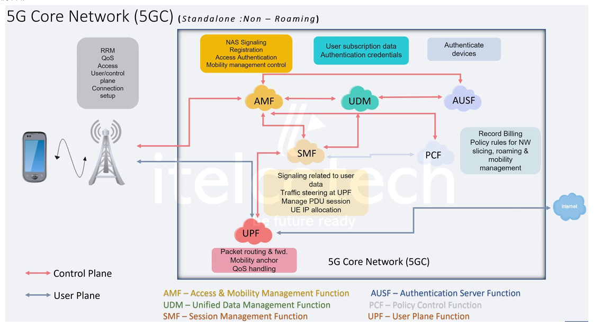
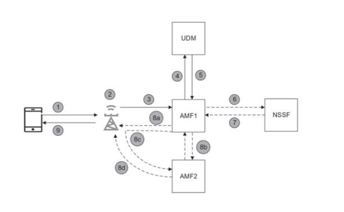

# 📡 5G Core Network & Network Slicing

## 5G Core (Standalone Mode)



### Core Functions

- **AMF (Access & Mobility Management Function)**  
  Handles registration, mobility, access authentication, and connection management.

- **SMF (Session Management Function)**  
  Manages PDU sessions, allocates UE IP, and controls user-plane traffic steering at UPF.

- **UPF (User Plane Function)**  
  Forwards and routes user data packets, manages QoS, and acts as a mobility anchor.

- **UDM (Unified Data Management)**  
  Stores and manages subscriber data and authentication credentials.

- **AUSF (Authentication Server Function)**  
  Authenticates devices and users in coordination with UDM.

- **PCF (Policy Control Function)**  
  Enforces policies for QoS, slicing, roaming, mobility, and billing.

---

## 5G Network Slicing


Network slicing enables the creation of isolated, end-to-end logical networks that can run concurrently over a shared 5G infrastructure.  
Each slice can be tailored with different performance characteristics such as **latency, bandwidth, and reliability** depending on the use case.

### 🔹 Importance of Network Slicing
- **Customization**: Different services have different requirements.  
- **Efficiency**: Optimal use of resources by allocating only what's needed.  
- **Scalability**: Easy to scale or deploy new slices for emerging use cases.  
- **Security**: Slices are isolated from each other, reducing security risks.  

### 🔹 Challenges in Network Slicing
- Complex orchestration and management  
- Interoperability between vendors  
- Security and isolation between slices  
- Dynamic resource allocation  

### 🔹 Applications of Network Slicing
- Smart cities  
- Autonomous vehicles  
- Telemedicine  
- Virtual Reality (VR) & Augmented Reality (AR)  
- Industrial automation  

---

## Registration Procedure



---

## Signalling Flow


---

## Example Command

```bash
sudo apt update
