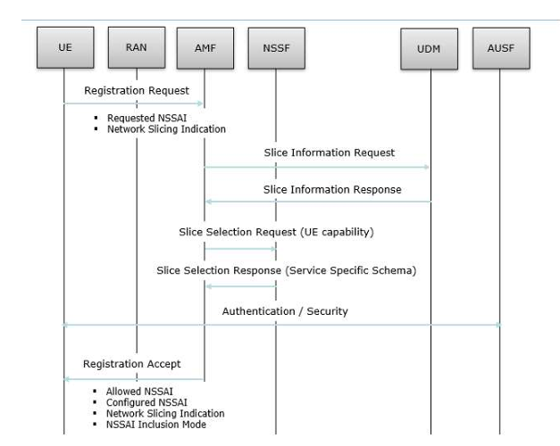

# 5G Network Slicing

Network slicing enables the creation of isolated, end-to-end networks that can run 
concurrently over a common 5G infrastructure”. These slices can be customized with 
different performance characteristics such as latency, bandwidth, and reliability, 
depending on the use case.

## Importance of Network Slicing
• Customization: Different services have different requirements. 
• Efficiency: Optimal use of resources by allocating only what's needed. 
• Scalability: Easy to scale or deploy new slices for emerging use cases. 
• Security: Slices are isolated from each other, reducing security risks. 

## Challenges in Network Slicing
• Complex orchestration and management. 
• Interoperability between vendors. 
• Security and isolation between slices. 
• Dynamic resource allocation.

## Applications of Network Slicing
• Smart cities 
• Autonomous vehicles 
• Telemedicine 
• Virtual Reality (VR) and Augmented Reality (AR) 
• Industrial automation

```bash
sudo apt update
```


